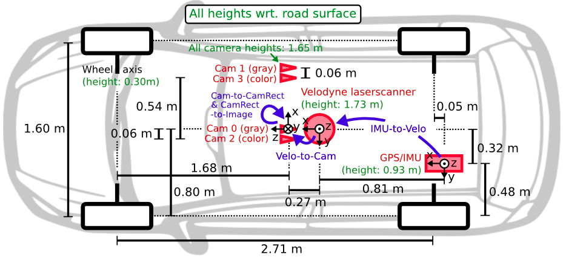
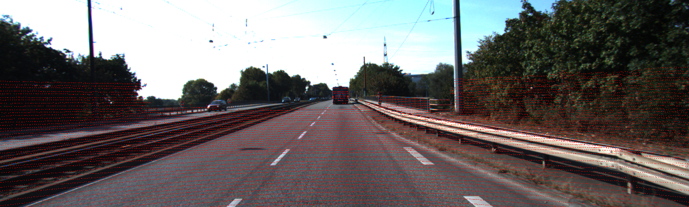
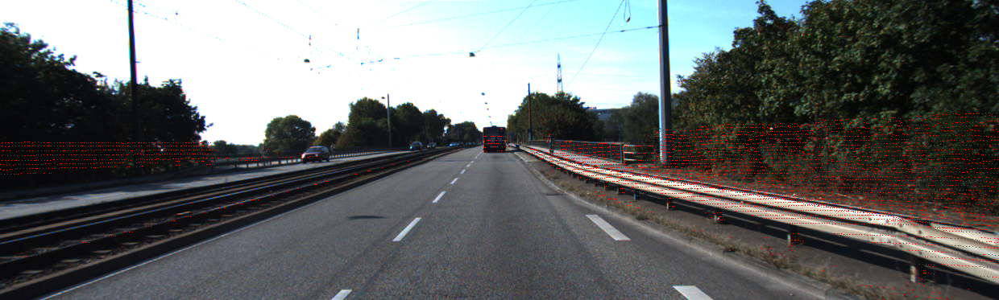
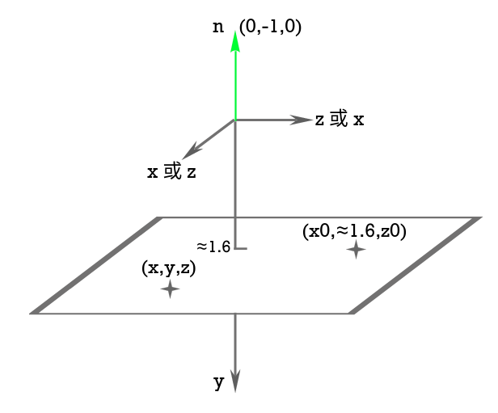
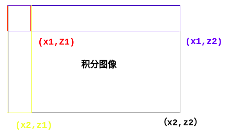

# 传感器和数据
<center>
<span id="trans">

**坐标转换**</span> 
</center>
<center></center>

- 存在问题
  - [obj_utils](../wavedata/wavedata/tools/obj_detection/obj_utils.py).get_lidar_point_cloud()读取velo坐标系下的点云(x,y,z,r),并保留在相机前方、且在图片内的三维点云point_cloud，该点云坐标转换到了相机坐标。
  - index=23时,
    - 原始数据，在velo坐标系下
      - x大概~(-79,74.8) 
      - y大概~(-26,57)#?? 怎么感觉是反的#单位不是m,并不知道是什么
      - z大概~(-7,2.9)  
    - 转换到相机坐标
      - x大概~(-57.7,26.4) 
      - y大概~(-3.8,6.6)
      - z大概~(-79,74.5)
    - 截取在相机前的点云
      - x大概~(-47.6,21) 
      - y大概~(-1.39,3.67)
      - z大概~(2.9,74.5)
    - 可以投影到图像里的点云(相机坐标系)
      - x大概~(-32,17) 
      - y大概~(-1.37,3)
      - z大概~(4.5,74.5)
      - 投影到像素坐标
      - 
    - [kitti_utils](../avod/datasets/kitti/kitti_utils.py).create_slice_filter()里:主要看y，见[plane](#plane)
      - point_cloud[:,offset_filter]保留plane上方offset_dist=2以下的点云(向下为+y)
        - x大概~(-32,17) 
        - y大概~(-0.659,3)
        - z大概~(4.5,68.7)
      - point_cloud[:,road_filter]保留plane上方plane_offset_dist=0.2以下的点云
        - x大概~(-32,9.5) 
        - y大概~(1.2,3)
        - z大概~(5,59.8)
      - point_cloud[:,slice_filter]保留plane上方0.2以上，2以下的点云。filtered_points
        - x大概~(-32,17) 
        - y大概~(-0.659,1.9) #plane是斜的，不是严格的(0,-1,0)
        - z大概~(4.5,68.7)
      - 
  

## <span id="plane">plane</span>
通过车辆的IMU数据(倾斜角，俯仰角，偏航角)计算得到
The format is the following:
<font size=3>
> Width 4
> Height 1
> -7.051739e-03 -9.997791e-01 -1.980150e-02 1.680367e+00
</font>

- [-7.051739e-03 -9.997791e-01 -1.980150e-02] 水平面的单位法向量. 几乎和 [0 -1 0] 相等，说明地面平坦。根据[obj_utils]((../wavedata/wavedata/tools/obj_detection/obj_utils.py)).get_road_plane()里描述的+y是向下的，也许是和cam所在坐标系一致。这里法向量向上。
- 第4个数据1.68代表相机距离水平面的高度。

- 一个法向量(A,B,C)和一个点($x_0$,$y_0$,$z_0$)确定一个平面
  - $\begin{aligned}
    &(A,B,C)\bot (x-x_0,y-y_0,z-z_0)\\
    \Leftrightarrow \quad&A(x-x_0)+B(y-y_0)+C(z-z_0)&=0\\
    \Leftrightarrow \quad&Ax+By+Cz-(Ax_0+By_0+Cz_0)&=0\\
    \Leftrightarrow \quad&Ax+By+Cz+D&=0\\
    其中，&D=-(Ax_0+By_0+Cz_0)
  \end{aligned}$ 
  - 在avod中(A,B,C)$\approx$(0,-1,0).D$\approx y_0$
  - $y_0\approx 1.6$，相机高度$\approx$1.65m。+y轴向下，使用的坐标系应该就是相机cam2所在坐标系。
<center></center>
  
- 若(0,-1,0,D)*(x,y,z,1)=0，则y=D,点(x,y,z)在平面y=D里。
- 若(0,-1,0,D)*(x,y,z,1)<0，则y>D,点(x,y,z)在平面y=D下方。
- 若(0,-1,0,D)*(x,y,z,1)>0，则y<D,点(x,y,z)在平面y=D上方。

- 在obj_utils.get_point_filter()里保留(0,-1,0,D-offset_dist)*(x,y,z,1)<0，即保留y>D-offset_dist的点云。
- 根据avod [issue](https://github.com/kujason/avod/issues/86)所言，D是相机距离plane的高度，那么保留y>D-offset_dist的点云,也就是保留plane上方offset_dist以下的点云。即:(0,-1,0,D-offset_dist)*(x,y,z,1)<0保留plane上方offset_dist以下的点云

## calib
- 所有四个摄像机的校准
  - P0：第一个相机的内参
  - P1：第二个相机的内参
  - P2：第三个相机的内参
  - P3：第四个相机的内参
  - R0_rect：所有相机的畸变校准矩阵
  - Tr_velo_to_cam
  - Tr_imu_to_velo
  
- 坐标转换的转移矩阵见[坐标变换图](#trans)，[刚体变换教程](https://www.bilibili.com/video/av59593514?p=2)
  - **坐标左乘变换矩阵**
  - 刚体变换教程里描述是：$p_R=T_{RW}*p_W$，这是为了公式上的美观，$W$紧挨着$p_W$
  - 这里的$T_{RW}$实际上等价于 W坐标系转换R坐标系的矩阵($T_{W\to R}$)
  - 即：$p_R=T_{W\to R}*p_W$
- 点云坐标$\to$相机坐标
`p_cam = R0_rect * Tr_velo_to_cam * p_velo`
- 相机坐标$\to$像素坐标
`point_in_im = P2 * p_cam`

## image_2
左侧的彩色摄像机拍摄的图像

## label_2
The format is the following:
> <font size=3>Pedestrian 0.00 0 -0.20 712.40 143.00 810.73 307.92 1.89 0.48 1.20 1.84 1.47 8.41 0.01</font>

| Values |        Name        |                                                         Description                                                         |
| :----: | :----------------: | :-------------------------------------------------------------------------------------------------------------------------: |
|   1    |        type        | Describes the type of object: 'Car', 'Van', 'Truck', 'Pedestrian', 'Person_sitting', 'Cyclist', 'Tram','Misc' or 'DontCare' |
|   1    | truncated<br>截断  |    Float from 0 (non-truncated) to 1 (truncated), where truncated refers to <b>the object leaving image boundaries </b>     |
|   1    | occluded<br>被遮挡 |   Integer (0,1,2,3) indicating occlusion state: 0 = fully visible, 1 = partly occluded 2 = largely occluded, 3 = unknown    |
|   1    |       alpha        |                                       Observation angle of object, ranging [-pi..pi]                                        |
|   4    |        bbox        |         2D bounding box of object in the image (0-based index):contains left, top, right, bottom pixel coordinates          |
|   3    |     dimensions     |                                   3D object dimensions: height, width, length (in meters)                                   |
|   3    |      location      |                                 3D object location x,y,z in camera coordinates (in meters)                                  |
|   1    |     rotation_y     |                                  Rotation ry around Y-axis in camera coordinates [-pi..pi]                                  |
|   1    |       score        |            Only for results: Float, indicating confidence in detection, needed for p/r curves, higher is better.            |
'DontCare'：未被标记的物体,由于物体离雷达太远

# RPN
## 聚类
[label_cluster_utils](../avod/core/label_cluster_utils.py).get_clusters()对训练集里的每个样本对应类的所有目标的长宽高进行聚类，保存x个聚类中心点和x个标准差。
- 得到每个class聚类后的长宽高

## anchor
- all_anchor_boxes_3d
  - 一系列[x, y, z, l, w, h, ry] 其中所有anchor x从小到大,z从大到小,y是plane平面内与x,z对应的体素坐标
    - (x,y,z)是box中心点
    - (l,w,h)当前类的长宽高聚类中心点
    - ry是旋转角度(0或pi/2)
- anchor
  - [x, y, z, dim_x, dim_y, dim_z]
    - (x,y,z)是box中心点
    - (dim_x, dim_y, dim_z)anchor的x,y,z方向的长宽高。由l, w, h, ry得到
- 在体素网络中，每个体素网格具有由ry种类确定个数的anchor，保留存在点云的体素网格对应的anchor
- **anchor_info**: [mini_batch_preprocessor](../avod/core/mini_batch_preprocessor.py)._calculate_anchors_info()
  - 对每个anchor保留与gt每个目标中的最大IOU
  - 位移量/anchor长、log(gt_长/anchor_长)
  - 最大IOU对应的class

## 体素voxel
- [voxel_grid_2d](../wavedata/wavedata/tools/core/voxel_grid_2d.py).voxelize_2d()
- 将点云y坐标都置0，相当于俯视图
- 将点云坐标离散化为体素voxel，相当于将空间划分为voxel_size大小的网格，统计在网格里的点云个数，网格坐标voxel_coords只保留一个。
- leaf_layout_2d:体素网，网格内包含点云则用0表示，不包含点云则用-1表示
- 保留在area_extents内的点云
- 体素坐标范围由config中的area_extents/voxel_size确定

## 积分图像
<center></center>

- [integral_image_2d](../wavedata/wavedata/tools/core/integral_image_2d.py).query():
  - ```
    output = self._integral_image[x2, z2] + \
            self._integral_image[x1, z1] - \
            self._integral_image[x2, z1] - \
            self._integral_image[x1, z2]
    ```
  - 得到box里元素的和,积分图像见[代码](#integral)
  - 为什么不sum([x1:x2,z1:z3])的原因是需要调用多次累加耗时
  - 采用积分图像计算量减小

# code tips
- 多维的排序、多维的去重:[voxel_grid_2d](../wavedata/wavedata/tools/core/voxel_grid_2d.py).voxelize_2d()函数里
- 点云floor->int，然后多维排序、去重进行量化:[voxel_grid_2d](../wavedata/wavedata/tools/core/voxel_grid_2d.py).voxelize_2d()函数里
- np.sum等有axis的理解:
  - eg: x=[\[\[0,1],\[2,3]],\[\[4,5],\[6,7]]]
    - $\begin{pmatrix}
      \begin{pmatrix}
        0&1\\
        2&3\\
      \end{pmatrix}\\
      \begin{pmatrix}
        4&5\\
        6&7\\
      \end{pmatrix}
    \end{pmatrix}$
  - np.sum(x,axis=0)
    - $\begin{pmatrix}
      4&6\\
      8&10\\
    \end{pmatrix}$
    - ```
      for i
        for j
          sum(x[:,i,j])
      ```
- 原点index(0,0)当左上角 img index当右下角的矩形框里元素和
  - <span id="integral">integral_image = np.cumsum(np.cumsum(img, 0), 1)</span>
- 数组的切片实现原理应该和zip的迭代类似
  - [kitti_uitils](../avod/datasets/kitti/kitti_utils.py)._project_and_show
  - img_array:(375,1242,3)
  - point_in_im:二维，img_array前两维的索引
  - img_array\[point_in_im[:,0],point_in_im[:,1],:]=ImageColor.getrgb(color)